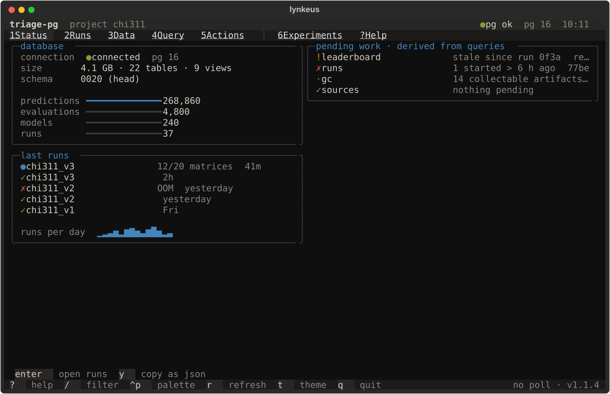
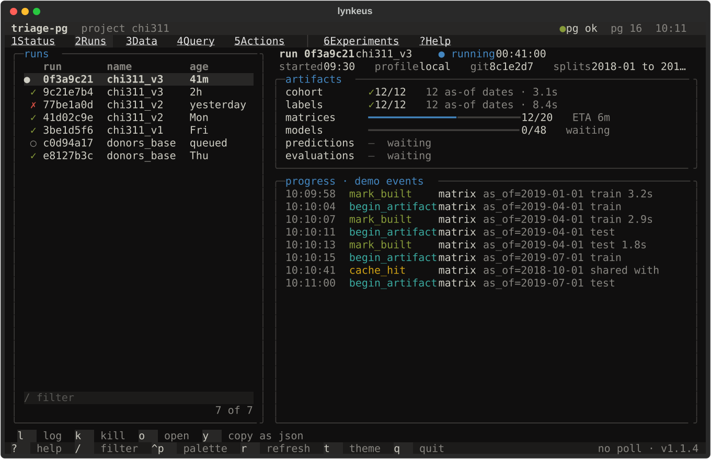
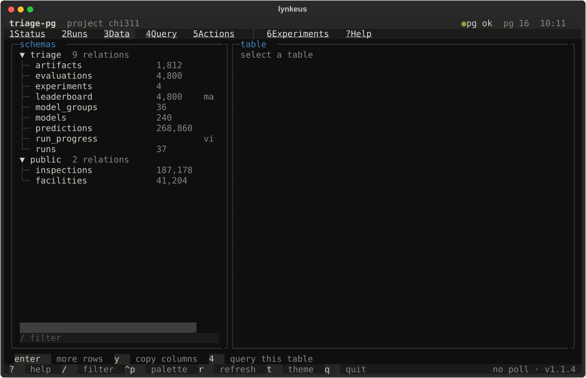
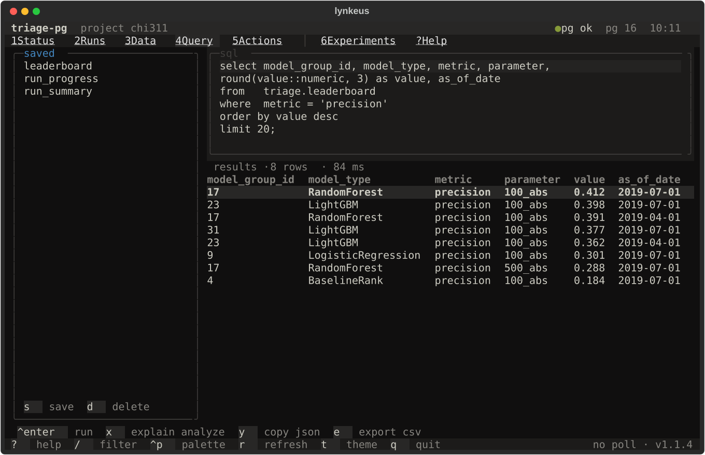
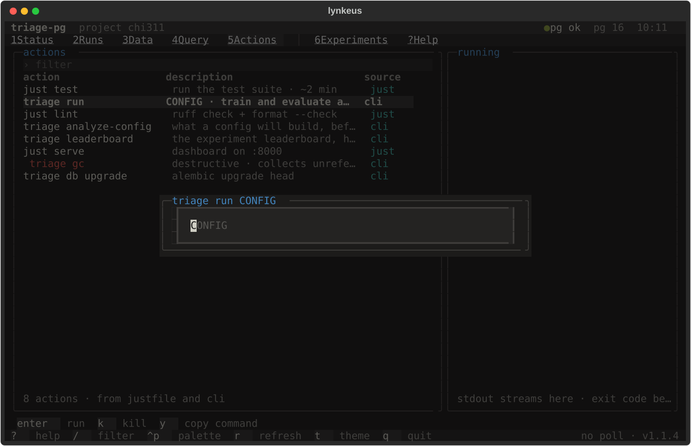

# lynkeus

A shared [Textual](https://textual.textualize.io/) shell for terminal cockpits
over PostgreSQL-backed data projects. It gives every project the same six
screens (Status, Runs, Data, Query, Actions, Help), the same keys, one theme
and a Postgres source that refuses to start without credentials. A project
supplies three small adapters and its own screens. The same data the screens
render is available as JSON from the project's CLI, so an agent reads what a
person watches.

## Why the name

Lynceus (Greek Λυγκεύς, Lynkeus) sailed on the Argo as its lookout. The poets
gave him the sharpest eyes of any mortal and said he could see through wood
and earth. This package is the lookout of a data project. It watches runs,
tables and pending work from the terminal and reports what it sees. It never
steers; steering stays with the project's own CLI, which the shell runs as a
subprocess when asked. The Greek transliteration is the package name because
the Latin spelling was already taken on PyPI. Argos and Panoptes were
considered and dropped, both taken, and Panoptes carries the panopticon along
with it.

## Status

1.0, and the API is frozen. Five projects consume the shell: triage-pg,
acervo, meio-sim, corredor and featurizer. Between them they cover a typer
CLI and an argparse one, runs that are processes and runs that are tables, a
review queue that writes through the CLI, Dagster materializations started
from the palette, and a library with a Python 3.10 floor that carries the
shell as an extra behind a version marker. The last two rounds changed nothing
in the contract, which is what the freeze rests on.

Frozen means: the three adapter protocols, `DataSource`, the models in
`lynkeus.models`, `ShellApp`'s keyword arguments, `ShellScreen`'s hooks, the
`lynkeus.commands` functions and `lynkeus.actions` keep their names and
signatures through 1.x. New fields, new keyword arguments and new attributes
an adapter may carry are additive and arrive in 1.x releases. Renaming or
removing any of them is a 2.0. The history is in `CHANGELOG.md`.

The Textual ceiling moved twice in 1.1.0 and ended at `textual>=6.5,<9`: the
dominoes round raised it to admit 7.5, the azmu round to admit 8.2.8, so the
shell now accepts Textual 6 through 8. The three screen snapshots that differed
were re-taken under each version in turn; what differed was one cell's
background on the Query and Actions screens and a column width in the Actions
prompt, and nothing in the contract. The lock file and CI run on 8.2.8.

## Changing the shell from a consumer

Nobody pushes to `main`. Branch protection requires a pull request and green
CI from everyone, the shell's own session included.

- **Additive**, which is a new field, keyword argument or adapter attribute,
  or a fix: switch the consumer to `uv add --editable ../lynkeus`, branch as
  `<consumer>/<need>`, make the change together with the test that fails
  without it and a line in `CHANGELOG.md`, and open the pull request. Keep
  working on the editable path meanwhile. The review is three checks: CI
  green, nothing renamed or removed, no signature changed. Merge, tag `1.x`,
  and the consumer swaps its pin back to the tag.
- **Breaking**, which is a rename, a removal, a changed signature or the
  Textual cap: open an issue first. It is a 2.0 conversation, not a pull
  request.

The pull request keeps what made the 0.3.1 and 0.3.2 rounds fast, a change
arriving with its failing case, and adds the one thing they lacked, a gate
before `main` moves.

## Install

Not published on PyPI. Pin a git tag:

```bash
uv add "lynkeus @ git+https://github.com/nanounanue/lynkeus.git@v1.1.0"
```

Python 3.12 or newer. Runtime dependencies are Textual 6 to 8, Rich, psycopg 3
and loguru.

## The shell

The five working screens, taken from `python -m lynkeus.demo` against the
fake adapters the tests use, at 110 by 34 cells.











Keys `1`–`5` open the standard screens, `6`+ the project's own, `?` help.
`/` focuses the current filter, `^p` the command palette (tabs, refresh,
theme, and every project action), `r` refreshes, `t` flips dark/light, `q`
quits. Each screen adds its own row of keys above the footer.

| Screen | Reads | Keys |
|---|---|---|
| Status | `StatusAdapter.status()` — health, facts, gauges, last runs, a sparkline, pending work | `enter` runs · `y` copy json |
| Runs | `RunsAdapter.list/show/events` — list, stages, live log | `l` log · `k` kill · `o` open url · `y` copy json |
| Data | `DataSource.tables/table_detail` — catalog, sizes, columns, indexes, sample rows | `enter` more rows · `y` copy columns · `4` query this table |
| Query | `DataSource.query/explain` — editor, results, saved queries | `^enter` run · `x` explain · `y` json · `e` csv · `s` save · `d` delete |
| Actions | `ActionsAdapter.list/run` — palette, streamed stdout, exit code | `enter` run (prompts when the action declares `args`) · `k` kill · `y` copy command |
| Help | the keys above | `esc` |

Every read runs inside a `read only` transaction that is rolled back. The
only way the shell changes anything is Actions, which starts the project's
own CLI or `just` recipe as a subprocess; destructive actions are confirmed
first and the exit code becomes the run's state. An action carrying an `args`
hint (`Action("triage run", …, args="CONFIG")`) is prompted for them before it
starts — running such a verb bare would only print its usage and exit 2.

## Plugging a project in

```python
from lynkeus import PgSource
from lynkeus.app import ShellApp

app = ShellApp(
    project="triage-pg",
    subtitle="project chi311",
    status_adapter=MyStatus(source),
    runs_adapter=MyRuns(source),
    actions_adapter=MyActions(),
    source=PgSource.from_env(),  # or PgSource(dsn=conninfo)
    project_screens=[ExperimentsScreen(source)],
    saved_queries={"leaderboard": "select … from triage.leaderboard"},
    version="v1.1.4",
)
app.run()
```

The three protocols live in `lynkeus.adapters`:

| Protocol | Feeds | Reads |
|---|---|---|
| `StatusAdapter` | Status screen, `<proj> status --json` | health, facts, last runs, pending work derived from queries |
| `RunsAdapter` | Runs screen, `<proj> runs list/show/tail` | the project's runs table, `LISTEN` or polling for progress |
| `ActionsAdapter` | Actions palette, `<proj> actions list/run` | `just --dump` plus the project's CLI commands, run as subprocesses |

The Data and Query screens need only a `DataSource`; `PgSource` is one, so
they cost a project nothing beyond credentials. A source may also carry two
optional attributes the shell reads with defaults: `label`, the engine's name
in the header's health dot (`pg ok` by default, `sqlite ok` for a project
whose state is a file), and `explain_label`, what the Query screen's `x` key
does in the source's own words (`explain analyze` by default; SQLite's
`explain query plan` executes nothing, so it is a different thing rather than
the same thing spelt differently).

A `RunsAdapter` may also carry two optional attributes the Runs screen reads
with defaults: `mode`, the wording after `progress ·` in the log panel's title
(`"LISTEN run_progress"`, or `"nothing to stream"` for a project whose runs
are tables rather than processes), and `id_width`, how many characters of a
run id the list and header show — 8 by default, which suits a hash or a uuid;
a project whose ids are names (`example_01.customers`) sets it wider. A run
with no `started_at` shows no `started` label, and an `events()` that yields
nothing leaves the log empty under that title.

A project screen subclasses `lynkeus.screens.ShellScreen`, sets `SLUG`,
`TITLE`, `KEYS`, composes its widgets and ends with `self.keys_bar()`.
`refresh_data()` runs on `r`, on activation and on every poll; `load(fn,
on_done)` runs an adapter call in a thread and hands the result back on the
UI thread. `sql_for_selection()` lets `4` open the Query screen on whatever
the screen has selected.

## Headless

`lynkeus.commands` holds plain functions — `status`, `runs_list`,
`runs_show`, `runs_tail`, `query`, `actions_list`, `actions_run` — that print
a Rich table or, with `json_out=True`, JSON, and return the model they
printed. A typer or argparse project wires them to its own verbs.

## Testing a consumer

```python
# conftest.py
pytest_plugins = ["lynkeus.testing"]


# test_tui.py
def test_runs(shell_snapshot):
    assert shell_snapshot(my_app(), keys=["2"])
```

`shell_snapshot` wraps `pytest-textual-snapshot`, settles every thread worker
before capturing, and takes `keys` to press and an async `before(pilot)`.
`lynkeus.testing.settle`, `press` and `screenshot` drive a Pilot by hand.
Freeze the clock (`ShellApp(clock=lambda: NOW)`) and disable polling
(`poll_seconds=0`) for deterministic captures; `lynkeus.demo.demo_app()` is
the reference, with fake adapters and no database:

```bash
uv run python -m lynkeus.demo          # frozen clock
uv run python -m lynkeus.demo --live   # ticking clock, polling on
```

## API

- `lynkeus.app.ShellApp` — the shell.
- `lynkeus.adapters` — `StatusAdapter`, `RunsAdapter`, `ActionsAdapter`,
  `DataSource` (with the optional `label` and `explain_label`).
- `lynkeus.models` — `Status`, `Health`, `Gauge`, `Series`, `PendingItem`,
  `Run`, `RunDetail`, `Stage`, `RunEvent`, `Action`, `QueryResult`,
  `TableInfo`, `TableDetail`, `ColumnInfo`, `IndexInfo`; each has `to_json()`,
  the screen-level ones `to_rich()`.
- `lynkeus.screens` — `ShellScreen` and the six standard screens.
- `lynkeus.commands` — the headless functions.
- `lynkeus.pg.PgSource` — `from_env()`, `rows()`, `query()`, `explain()`,
  `tables()`, `table_detail()`, `listen(channel, timeout)`, `health()`.
  `from_env()` raises `MissingCredentials` instead of guessing a host.
- `lynkeus.text` — `spark`, `bar`, `age`, `elapsed`, `clip`, the state glyphs.
- `lynkeus.theme` — `FLEXOKI_DARK` and `FLEXOKI_LIGHT`; the shell registers
  both and `t` toggles. Widgets only ever name theme variables.
- `lynkeus.testing` — `settle`, `press`, `screenshot`, the `shell_snapshot`
  fixture.

## Configuration

Credentials are read from the environment only: `DATABASE_URL`, or
`PGDATABASE` and `PGHOST` with `PGUSER` and `PGPASSWORD`. In this workspace
direnv loads them from the project's `.envrc`. There is no default host and no
prompt. A project that resolves its database another way passes the libpq
conninfo it already has to `PgSource(dsn=...)`.

## Development

```bash
just sync        # uv sync, all groups
just test        # pytest, the database-free tier
just lint        # uv run ruff check
just fmt         # uv run ruff format
just typecheck   # uv run basedpyright
just check       # lint, typecheck, test
```

Snapshot tests back every screen; after a deliberate visual change run
`uv run pytest --snapshot-update` and read the diff before committing it.

The tests come in two tiers. The default tier needs no database: it drives the
shell through Pilot against the fake adapters in `lynkeus.demo`. The
`integration` tier runs the SQL in `PgSource` against a real server, because
the catalogue queries behind the Data screen, the read-only guarantee behind
Query and `LISTEN` behind the Runs progress log cannot be verified any other
way.

```bash
just db-up       # a disposable PostgreSQL on 127.0.0.1:11401, data in tmpfs
just test-all    # both tiers
just db-down     # remove it and its data
```

The integration tier skips itself when no server answers, so `just test` and
`just check` stay useful with nothing running. Point `LYNKEUS_TEST_DSN` at
another server to use one; each test builds and drops its own uniquely named
schema and touches nothing else. CI runs the fast tier on Python 3.12 and
3.13 and the integration tier on PostgreSQL 14, 16 and 17.

Decisions are recorded in `docs/adr/`, and every release in `CHANGELOG.md`.
